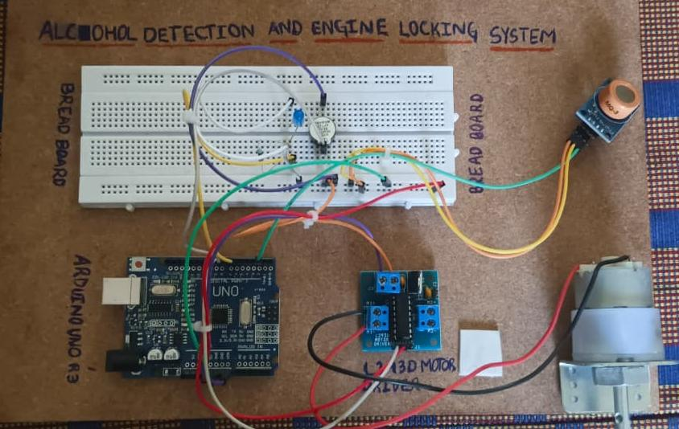

# 🚗 Alcohol Detection and Engine Locking System using Arduino

## 📌 Overview

This project is designed to enhance road safety by preventing vehicle ignition when alcohol is detected. It uses an MQ-3 alcohol sensor with Arduino Uno to monitor alcohol levels and control engine operation automatically.

---

## 🎯 Objective

To reduce drunk driving accidents by implementing a real-time alcohol detection and engine locking system.

---

## 🔧 Components Used

* Arduino Uno
* MQ-3 Alcohol Sensor
* L293D Motor Driver
* DC Motor
* Buzzer
* LED
* Jumper Wires

---

## ⚙️ Working Principle

1. The MQ-3 sensor detects alcohol concentration in the air.
2. Arduino reads sensor values continuously.
3. If alcohol level exceeds the threshold:

   * Engine (motor) is turned OFF
   * Buzzer alert is activated
   * LED indicates warning
4. If no alcohol is detected:

   * Engine runs normally

---

## 📸 Project Images

---

## 🎥 Demo Video

[(Project Drive link here)](https://drive.google.com/file/d/16CM5CEasG4-S4pEI7nMu2WqyBC0l6HF8/view?usp=drive_link)

---

## 💻 Code

The Arduino code is available in this repository.

---

## 🚀 Future Enhancements

* GSM module for sending alerts
* IoT integration for real-time monitoring
* Mobile app connectivity
* GPS tracking system

---

## ⚡ Applications

* Automotive safety systems
* Smart vehicle ignition control
* Fleet monitoring systems

---

## 👨‍💻 Author

**Dileep Kumar Neeli**

---
