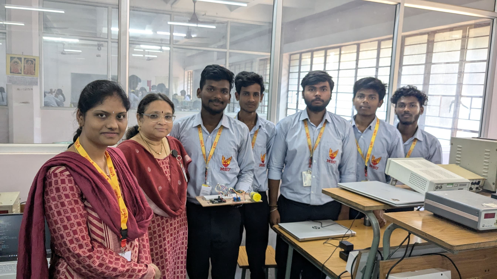
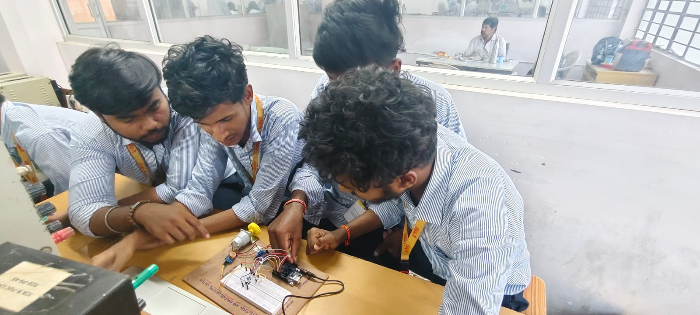
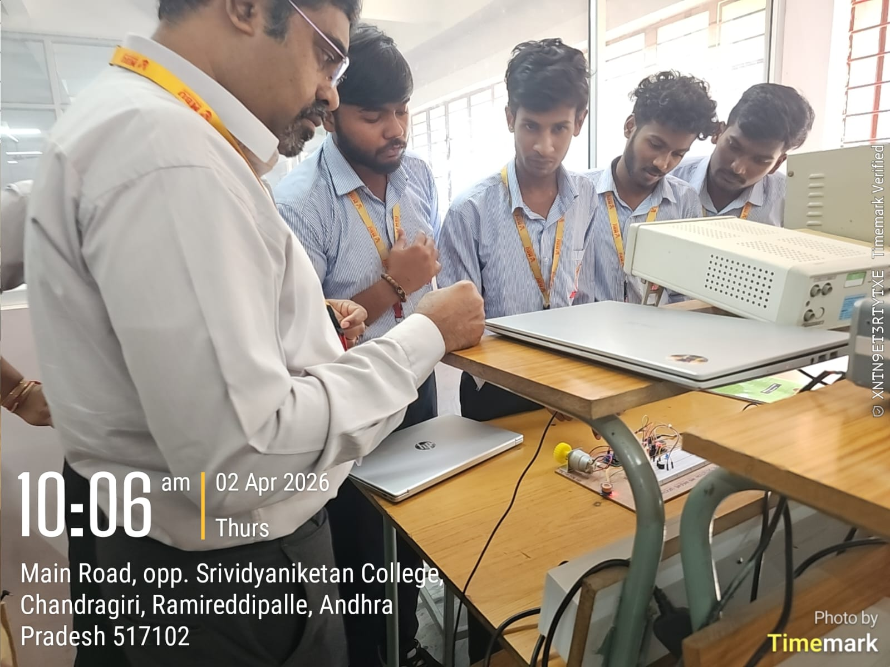
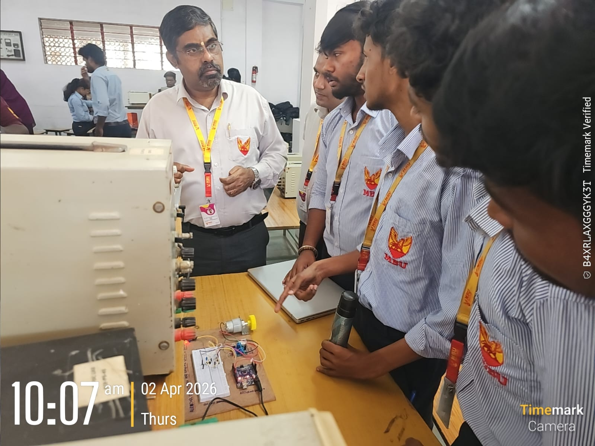

# 🚗 Alcohol Detection and Engine Locking System using Arduino

## 📌 Overview

This project detects alcohol using an MQ-3 sensor and prevents the vehicle from starting if alcohol is detected.

## 🔧 Components Used

* Arduino Uno
* MQ-3 Alcohol Sensor
* L293D Motor Driver
* DC Motor
* Buzzer
* LED

## ⚙️ Working

* The MQ-3 sensor detects alcohol levels.
* If alcohol exceeds threshold:

  * Engine (motor) stops
  * Buzzer alert is activated
* Otherwise, engine runs normally.

## 📸 Project Images

## 🎥 Demo Video

[(Add video link here)](https://drive.google.com/file/d/16CM5CEasG4-S4pEI7nMu2WqyBC0l6HF8/view?usp=drive_link)

## 💡 Future Improvements

* Add IoT (GSM alerts)
* Mobile app integration

## 👨‍💻 Author

NEELI DILEEP KUMAR
